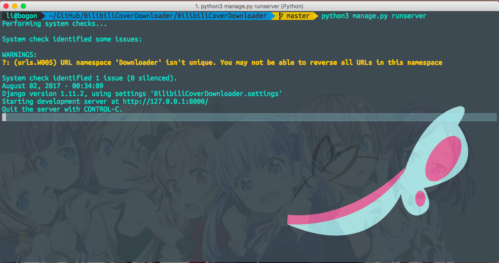
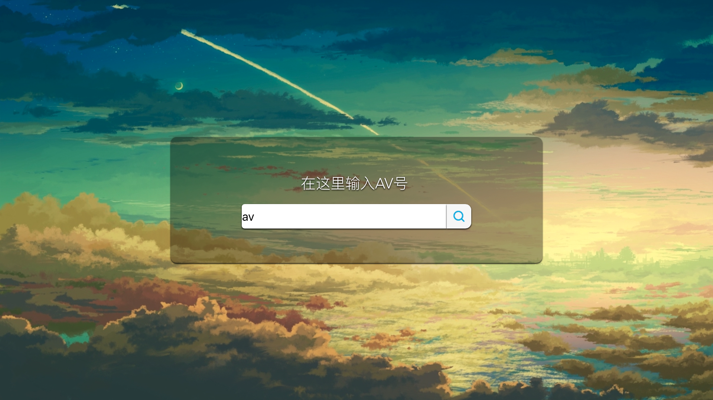

  
  <h3 align="center">Stone</h3>
  

    
  

 

## Love_at_first_sight

本来我以为写后端只能用php的，不过因为这个语言被黑的太惨了，所以就没有什么学习的兴趣 = = 然后发现python
可以用来写后端，真的是太开心了。因为python真的是太方便了，对于我这个用C++苦战算法的孩子来说，简直
就是一种心灵的慰藉。

Django这个框架十分的强大，通过她你可以

 - 轻松的给自己的网站创建好看的界面。
 - 轻松的管理URL
 - 轻松的建立后台和数据库的联系
 - 轻松的在前端和后端发送数据
 - 轻松的使用python库

## start!

	python3 manage.py runserver

假设你已经装过了`python3`和`Django1.11`那么你只需要cd到manage.py所在的目录然后运行这行命令，
就可以打开Django为你提供的测试服务器了。

>这时服务器默认运行在`127.0.0.1:8000`,这时你在浏览器里输入：127.0.0.1:8000 就可以看到你的项目
对应的视图界面了（像下面这样）。这里顺便我想吐槽一下，Django的测试服务器真的是太舒服了，你可以在第一时间
看到自己网站发生的变化，而不用自己搭一个服务器，鬼知道我把Django项目从本地装到vps的过程中发生了
什么。

>这中间发生了一些神奇的过程，顺便来解释一下Django的运作方式。Django采用的是MVC的模式（好吧，其
实都知道没什么好讲的，这里讲一下各个文件之间发生的联系好了）首先当浏览器访问`127.0.0.1:8000`时，
Django先从`urls.py`这个文件中，检索有没有匹配的地址。其实就是按顺序从上到下匹配一下`urlpatterns`
里的内容，如果有的话，就会跳转到`view.py`中的相关函数。然后经过了工作逻辑之后，由`view.py`中的python
函数，从`templates`文件夹里捡出来一个写好的模版页面，返回给浏览器，同时返回该页面所需要的静态文件。

## バイバイ

	好吧，我的权利的游戏第七季第三季刚刚下好了，现在是8月2号 1:06AM。 我已经把常用命令写到另外一个文档里了。
	今天就到此为止吧。明天再来更一波。
	
 
 
 
 
 
 
 
 
 
 
 
 
 
 
 
 
 
 
 
 
 
 
 
 
 
 
 
 
 
 
 
 
 
 
 
 
 
 
 
 
 
 
 
 
 
 
 
 
 
 
 
 
 
 
 

  

 

